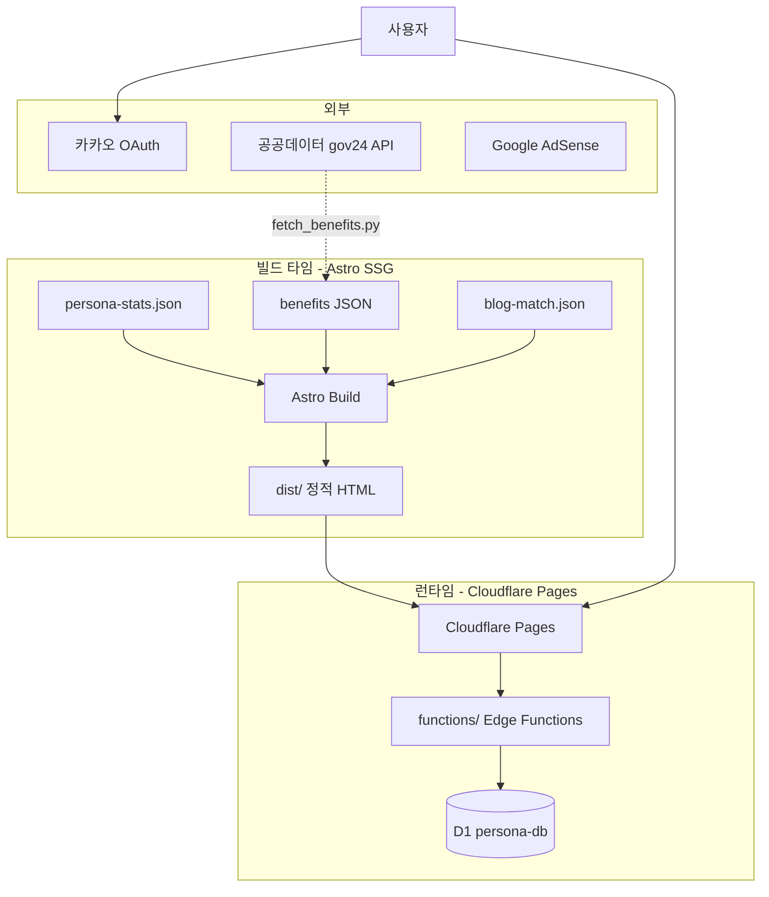
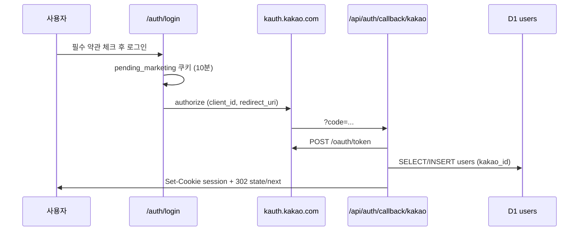

# money-aikorea24 기술 문서

> **한국인 페르소나** — 나이·성별·지역 기반 한국인 통계·지원금 매칭·금융 가이드 플랫폼  
> 최종 갱신: 2026-05-25 (2차 스캔 — 임금 추정·D1·OAuth·운영 보강)

---

## 1. 프로젝트 개요

### 1.1 목적

`money-aikorea24`는 **약 700만 명 규모의 한국인 인구통계 데이터**를 바탕으로, 사용자가 입력한 조건(지역·성별·나이·혼인 등)에 맞는 **페르소나 리포트**를 제공하는 정적 웹 서비스입니다. 동시에 다음을 결합합니다.

| 영역 | 설명 |
|------|------|
| **페르소나 분석** | 주거·학력·가족·직업·소득 분포, 유형 라벨, VS 비교, 공유 카드 |
| **정부 지원금** | 공공데이터포털 기반 혜택 DB + 연령/성별/지역 매칭 |
| **금융 블로그** | 보험·투자·대출·세금 카테고리 MD 콘텐츠 (~118편) |
| **커뮤니티** | 카카오 로그인 + Cloudflare D1 기반 게시판 (SSR/API) |
| **디지털 노마드** | 별도 `nomad` 컬렉션 (~6편) |

### 1.2 운영 도메인·배포 단위

| 항목 | 값 | 비고 |
|------|-----|------|
| **Canonical / Astro `site`** | `https://persona.aikorea24.kr` | `astro.config.mjs`, OAuth redirect, OG, 커뮤니티 |
| **Cloudflare Pages 프로젝트명** | `money-aikorea24` | `wrangler pages deploy --project-name money-aikorea24` |
| **레거시·브랜드 URL** | `https://money.aikorea24.kr` | `deploy.sh` 완료 메시지, `disclaimer.astro`, `JsonLd.astro` 일부 |

**도메인 관계 (리포지토리 기준):**

- 코드·인증·공유 링크는 **전부 `persona.aikorea24.kr`** 을 기준으로 작성됨.
- `money.aikorea24.kr` 은 **별도 Custom Domain** 이거나 과거 「머니」 브랜드 호스트일 수 있으나, **이 저장소만으로 DNS/리다이렉트 여부는 확인 불가**.
- 운영자 확인 절차: Cloudflare Dashboard → **Workers & Pages → money-aikorea24 → Custom domains** 에서 두 호스트 등록·Primary 여부 확인.

```text
[권장 이해]
persona.aikorea24.kr  →  Pages 프로젝트 money-aikorea24  →  dist/ + functions/
money.aikorea24.kr    →  (동일 프로젝트 alias 또는 별도 — 대시보드에서 확인)
```

### 1.3 아키텍처 요약



- **정적 페이지**: Astro `output: 'static'` — 페르소나·블로그·지원금 목록 등 대부분
- **동적 API**: `functions/` — 커뮤니티 CRUD, 카카오 인증, OG 리다이렉트
- **DB**: Cloudflare D1 (`persona-db`) — 사용자·게시글·댓글·좋아요

---

## 2. 기술 스택

| 계층 | 기술 | 버전(대략) |
|------|------|------------|
| 프레임워크 | [Astro](https://astro.build) | ^6.1.8 |
| 콘텐츠 | MD / MDX, Content Collections (`glob` loader) | — |
| 마크다운 | `remark-gfm` | ^4.0.1 |
| 이미지 | `sharp` (Astro 내장 파이프라인) | ^0.34.3 |
| 통합 | `@astrojs/mdx`, `@astrojs/sitemap`, `@astrojs/rss` | — |
| Cloudflare | Pages + Functions + D1 | `wrangler.toml` |
| 언어 | TypeScript (strict), Astro 컴포넌트 | Node ≥22.12 |
| 인증 | 카카오 OAuth 2.0 | REST API |
| 차트 (클라이언트) | Chart.js 4 (CDN) | `my-persona` |
| 배포 | `wrangler pages deploy`, `scripts/deploy.sh` | M1 전용 가드 |

`package.json`에 `@astrojs/cloudflare`가 있으나, **`astro.config.mjs`는 `output: 'static'`** 이므로 어댑터는 현재 빌드에 사용되지 않습니다. D1/API는 Pages **Functions** 바인딩으로 동작합니다.

---

## 3. 디렉터리 구조

```
money-aikorea24/
├── astro.config.mjs          # site URL, sitemap 필터, remark-gfm
├── wrangler.toml             # Pages 출력 경로, D1 바인딩
├── package.json
├── docs/
│   ├── TECHNICAL.md          # 본 문서
│   ├── adr/                  # Architecture Decision Records
│   └── schema/               # D1 역추론 DDL
├── public/                   # 빌드 시 그대로 복사
│   ├── persona-stats.json    # 페르소나 통계 (2,891 키)
│   ├── benefits*.json        # 지원금 원본/정제/큐레이션
│   ├── blog-match.json       # 페르소나 유형 → 블로그 링크
│   └── cards/                # OG/공유용 JPG (~2,892장)
├── src/
│   ├── pages/                # 라우트 (아래 §5)
│   ├── components/           # Header, Footer, BenefitCards, BaseHead 등
│   ├── layouts/              # BlogPost.astro
│   ├── content/              # blog/, nomad/ 마크다운
│   ├── content.config.ts     # Zod 스키마 + glob loader
│   ├── lib/                  # benefitMatcher, deadlineExtractor
│   ├── data/                 # wage-table, job-category-map
│   └── consts.ts             # SITE_*, COLLECTIONS
├── functions/                # Cloudflare Pages Functions
│   ├── api/auth/             # 카카오 콜백, 세션, 로그아웃
│   ├── api/community/        # posts, comments, like
│   ├── api/benefit-click.js  # 혜택 클릭 집계
│   └── og/index.js           # OG → /cards/ 리다이렉트
├── scripts/
│   ├── deploy.sh             # build → git push → wrangler deploy
│   ├── fetch_benefits.py       # gov24 API → benefits.json
│   ├── persona-publisher/    # 블로그 자동 발행 파이프라인 (Python)
│   └── *.mjs                 # 카드 프롬프트, 시드 생성 등
└── dist/                     # 빌드 산출물 (gitignore 권장)
```

---

## 4. 핵심 데이터

### 4.1 `persona-stats.json` (출처·가공)

| 항목 | 내용 |
|------|------|
| **경로** | `public/persona-stats.json` (~19MB) |
| **키** | `{지역}_{성별}_{나이}` — 예: `서울_남자_35`, `광주_남자_70대이상` |
| **규모** | 총 **2,891** (10년 **522** + 1년 **2,369**), **17**개 시·도 |

#### 원본·신뢰성

| 레이어 | 출처 | 역할 |
|--------|------|------|
| **페르소나 분포** | [NVIDIA Nemotron-Personas-Korea](https://huggingface.co/) (CC BY 4.0) | ~700만 합성 한국인 — `jobs`·`housing`·`family`·`education`·`marital`·`personas` 집계 |
| **소득·백분위** | KOSIS 고용형태별근로실태조사 등 (`income` 객체) | `income_employed`, `top_percentile`, 지역/연령 보정 — `scripts/patch-income.mjs` 로 필드 보강 가능 |
| **인구·이름** | KOSIS 주민등록, 대법원 성명 분포 등 | `about.astro` 명시 (Nemotron 파이프라인 경유) |

**가공 스크립트 (이 저장소):**

| 스크립트 | 역할 |
|----------|------|
| `scripts/patch-income.mjs` | `income_region_avg`, `income_national_avg`, `income_source` 등 패치 |
| (외부) Nemotron → 코호트 집계 | **리포지토리에 집계 파이프라인 없음** — JSON은 빌드 입력 아티팩트로 커밋 |

재현: upstream 집계 산출물을 `public/persona-stats.json` 에 교체 → `patch-income.mjs` (선택) → `npm run build`.

#### 값 스키마

| 필드 | 설명 |
|------|------|
| `total` | 해당 코호트 인원 수 |
| `housing`, `education`, `family`, `jobs`, `marital` | 항목별 카운트 객체 |
| `personas` | 서브 스토리 배열 (페이지 내 20명 그리드) |
| `income` | 취업자 월소득·추정·상위 백분위·출처 문자열 등 |

`jobs` 키는 **고유 직업명 2,120종** (Nemotron 직업 라벨). 빌드 시 `getStaticPaths()`가 전 키에 대해 HTML 생성.

### 4.2 지원금 JSON

| 파일 | 용도 | 규모(대략) |
|------|------|------------|
| `benefits.json` | API 원본 (`fetch_benefits.py`) | 대량 |
| `benefits-clean.json` | 정제·마감일 파싱 | **2,739**건 |
| `benefits-curated.json` | 수동 검증 우선 노출 | **24**건 |

페르소나 페이지에서는 **curated 우선 + clean 보충**(id 중복 제거)으로 병합합니다.

### 4.3 `blog-match.json`

페르소나 **유형 이름**(`pType.name`, 예: `월급 전부 내 맘대로 쓰는 사람`) → 관련 블로그 글 최대 4개 링크. 없으면 `한국인 평균형` 폴백.

### 4.4 임금·소득 데이터 파일

| 파일 | 용도 |
|------|------|
| `src/data/wage-table.json` | 직종 대분류 10개 월급(만원) + 성·연령 보정계수 — **직업 TOP5 뱃지** |
| `src/data/job-category-map.json` | Nemotron 직업명 → 10개 카테고리 키워드 매핑 |
| `persona-stats.json` → `income` | 코호트 **추정 월소득·백분위** (KOSIS 계열, §6.5와 별도) |

상세 로직: **[§6.5 직업별 임금 추정](#65-직업별-임금-추정-최근)** · ADR: [docs/adr/001-wage-data-kosis-vs-moel.md](adr/001-wage-data-kosis-vs-moel.md)

---

## 5. 라우팅 및 페이지

### 5.1 정적 라우트 (`src/pages/`)

| 경로 | 파일 | 역할 |
|------|------|------|
| `/` | `index.astro` | 히어로, 마감 임박 지원금, 카테고리, 최신 블로그 |
| `/my-persona` | `my-persona.astro` | 다단계 입력 UI → 결과·차트·공유 (클라이언트 JS) |
| `/persona/{slug}/` | `persona/[...slug].astro` | 통계 리포트 + 혜택 + 블로그 연결 |
| `/benefits/` | `benefits/index.astro` | 지원금 D-day 목록·검색 |
| `/blog/`, `/blog/{slug}/` | `blog/` | 콘텐츠 컬렉션 |
| `/blog/category/{id}/` | `blog/category/` | insurance, invest, loan, tax |
| `/nomad/` | `nomad/` | 디지털 노마드 글 |
| `/community/` | `community/index.astro` | API fetch 기반 목록 |
| `/community/write` | `community/write.astro` | 글쓰기 |
| `/community/{id}` | `community/[id].astro` | 상세 (noindex) |
| `/auth/login` | `auth/login.astro` | 카카오 로그인 진입 |
| `/about`, `/terms`, `/privacy`, … | 각 `.astro` | 정책·소개 |
| `/rss.xml` | `rss.xml.js` | RSS |

### 5.2 페르소나 URL 규칙

- JSON 키 `서울_남자_35` → URL `/persona/서울-남자-35/`
- **SEO 이중 구조**:
  - **10년 단위** (`30대` 등): `index,follow`, 사이트맵 포함
  - **1년 단위** (`35` 등): `noindex,follow`, canonical은 동일 지역·성별의 **10년 페이지**로 통합

`sitemap` 필터 (`astro.config.mjs`):

```javascript
// 숫자만 있는 나이(1년 페이지) → 사이트맵 제외
// '대' 또는 '이상' 포함 → 포함
```

### 5.3 Edge Functions (`functions/`)

| 엔드포인트 | 메서드 | 설명 |
|------------|--------|------|
| `/api/auth/callback/kakao` | GET | OAuth 코드 → 토큰 → D1 users → session 쿠키 |
| `/api/auth/kakao-session` | GET | 세션 조회 |
| `/api/auth/logout` | GET | 쿠키 삭제 |
| `/api/community/posts` | GET/POST/DELETE | 목록·작성·삭제 |
| `/api/community/posts/[id]` | GET | 상세 + 조회수 |
| `/api/community/comments` | GET/POST/DELETE | 댓글 |
| `/api/community/like` | POST | 좋아요 토글 |
| `/api/benefit-click` | POST/GET | 혜택 클릭 로깅 |
| `/og` | GET | 쿼리 `region,sex,age` → `/cards/{key}.jpg` 302 |

**D1 바인딩** (`wrangler.toml`):

```toml
[[d1_databases]]
binding = "DB"
database_name = "persona-db"
database_id = "476a89e1-4e2b-4b45-a2f8-e195127e5d32"
```

### 5.4 카카오 OAuth·세션 (상세)



| 항목 | 값 |
|------|-----|
| **Authorize URL** | `https://kauth.kakao.com/oauth/authorize` |
| **Redirect URI** | `https://persona.aikorea24.kr/api/auth/callback/kakao` (코드·카카오 개발자 콘솔과 일치 필수) |
| **Scope** | `profile_nickname`, `profile_image`, `account_email` |
| **로그인 진입** | `src/pages/auth/login.astro` |
| **콜백** | `functions/api/auth/callback/kakao.js` |

**세션 쿠키 `session`:**

| 속성 | 콜백 설정 | 로그아웃 (`/api/auth/logout`) |
|------|-----------|-------------------------------|
| **HttpOnly** | ❌ 없음 (JS에서 `Header.astro`가 `document.cookie` 파싱) | ✅ `HttpOnly` |
| **Secure** | ✅ | (삭제 시 Path=/) |
| **SameSite** | `Lax` | — |
| **Max-Age** | `604800` (7일) | `0` |
| **Payload** | Base64(JSON): `{ id, name, email, avatar }` — `name`은 **닉네임**만 노출 |

**보조 쿠키:** `pending_marketing=0|1` (로그인 직전 10분, 마케팅 동의 → DB `marketing_consent`)

**CSRF / state:**

- OAuth `state` 파라미터를 **로그인 URL에 넣지 않음** → 카카오 콜백의 `state`는 사실상 미사용.
- 로그인 후 이동 경로는 콜백에서 `state` 쿼리 또는 기본 `/community` — **고정 redirect URI 검증에 의존** (표준 OAuth CSRF 토큰 패턴 미적용 → 기술 부채).

**시크릿:** `env.KAKAO_CLIENT_SECRET` (선택). REST API Key는 **소스 하드코딩** (`login.astro`, `callback/kakao.js`) — Pages **Secrets** 로 이전 권장.

### 5.5 D1 스키마 (`persona-db`)

리포지토리에 **공식 마이그레이션 디렉터리 없음**. Functions SQL 역추론본:

- **문서:** [docs/schema/d1-inferred.sql](schema/d1-inferred.sql)
- **프로덕션 DDL 확인** (계정 권한 필요):

```bash
npx wrangler d1 execute persona-db --remote --command \
  "SELECT type, name, sql FROM sqlite_master WHERE type IN ('table','index') ORDER BY 1,2"
```

| 테이블 | 주요 컬럼 | 비고 |
|--------|-----------|------|
| `users` | `kakao_id`, `nickname`, `email`, `marketing_consent`, … | 시드 `id=0` (`generate-seed-posts.mjs`) |
| `persona_posts` | `board_type`, `persona_slug`, `views`, `likes`, `created_at` | 관리자 삭제: `user_id === 1` |
| `persona_comments` | `post_id`, `user_id`, `content` | |
| `persona_likes` | `(post_id, user_id)` UNIQUE | |
| `benefit_clicks` | `benefit_id` PK, `count`, `updated_at` | §16 모니터링 |

---

## 6. 비즈니스 로직

### 6.1 페르소나 유형 (`detectType`)

`persona/[...slug].astro` 내 규칙 기반 분류:

- 입력: 지역(수도권 여부), 나이대, 혼인·무직·가족·아파트 비율 등
- 출력: `{ name, emoji, desc }` — 예: `퇴근하면 청약통장 들여다보는 사람`
- 이 `name`이 **혜택 매칭·블로그 매칭**의 키로 사용됨

### 6.2 혜택 매칭 (`src/lib/benefitMatcher.ts`)

점수 기반 필터 (기본 50점):

1. **하드 필터**: `age_range`, `sex`, `regions`
2. **가점**: 큐레이션(`_curated` +25), 지역 특화(+15), 연령(+20)
3. **감점/경고**: 소득·재산 문구, URL 없음
4. **결과**: `eligible_likely` | `needs_check` | `not_eligible`, 상위 8건

### 6.3 마감일 (`src/lib/deadlineExtractor.ts`)

- 본문/필드에서 날짜 정규식 추출 (패턴 A)
- 실패 시 **회계연도 말(12/31)** 폴백 (패턴 B)
- `BenefitCards.astro`, 홈·지원금 페이지 D-day 표시에 사용

### 6.4 `my-persona` 플로우

1. 히어로 → 단계별 폼 (나이, 성별, 지역, 혼인 등)
2. slug 조합 후 `/persona/{slug}/` 또는 인라인 결과 렌더
3. Chart.js 막대/도넛, 카카오 공유 SDK, AdSense
4. 카드 이미지: `/cards/{region}_{sex}_{age}.jpg`

### 6.5 직업별 임금 추정 (최근)

**목적:** 페르소나 페이지 **「💼 직업군 TOP5」** 각 항목 옆 `월 NNN만원` 뱃지.  
**코호트 `income` 박스(취업자 추정·상위 %)** 와는 **별도 파이프라인** (§4.1).

#### 데이터

**`src/data/wage-table.json`**

- 출처: 고용노동부 **고용형태별근로실태조사** (문서상 2025년 6월 기준 월급여액, 만원)
- `jobCategory` (10): 관리자, 전문가, 사무종사자, 서비스종사자, 판매종사자, 농림어업숙련, 기능원, 장치기계조작, 단순노무, 무직(0)
- `ageSexFactor`: 성별 `남`/`여` × 연령구간 (`20대초`, `30대후`, `60대이상` 등)

**`src/data/job-category-map.json`**

- `rules[]`: `keywords[]` → `category` (위 10개 중 하나)
- **첫 매칭 우선** (규칙 순서 중요)
- `fallback`: `"사무종사자"`
- Nemotron `jobs` 키 **2,120 고유 직업명** 중 **175개(8.3%)** 만 fallback (2026-05-25 집계)

#### 계산식

```text
카테고리 = mapJobToCategory(직업명)     // 키워드 includes
연령키   = ageToFactorKey(ageRaw, ageNum)
월급(만원) = round( jobCategory[카테고리] × ageSexFactor[성별][연령키] )
```

- `jobCategory` 가 0 이거나 `무직` → `null` (뱃지 미표시)

#### 구현 위치 (`persona/[...slug].astro`)

| 함수 | 역할 |
|------|------|
| `mapJobToCategory(jobName)` | `jobMap.rules` 순회 |
| `ageToFactorKey(ageRaw, ageNum)` | 숫자 나이 또는 `30대` → `30대초`/`30대후` 등 |
| `getJobWage(jobName, sex, ageRaw, ageNum)` | 최종 만원 정수 |

UI: `topN(s.jobs, 5)` 루프에서 `getJobWage(k, sex, ageRaw, ageNum)` → `.job-wage-badge`.

#### KOSIS 시도 → 포기 (ADR)

초기 KOSIS OpenAPI `statisticsData.do` 로 **직종×성별×연령 3축** 교차표 수집 시도 → **단일 교차표 부재**로 중단, 고용부 CSV/공표 기반 `wage-table.json` 으로 전환.  
→ [docs/adr/001-wage-data-kosis-vs-moel.md](adr/001-wage-data-kosis-vs-moel.md)

**표기 정리 권장:** UI footnote에 "KOSIS"와 MOEL 직종 평균이 혼재 — 직업 뱃지는 **고용노동부 조사**, `income` 은 **KOSIS 계열**로 문구 분리.

---

## 7. 콘텐츠 시스템

### 7.1 Content Collections (`src/content.config.ts`)

공통 Zod 스키마:

- `title`, `description`, `draft` (기본 `true`)
- `pubDate`, `updatedDate`, `heroImage`, `tags`
- `category`: `insurance` | `invest` | `loan` | `tax` | `general`
- `needs_review`: 발행 파이프라인 검수 플래그

컬렉션:

- `blog` → `./src/content/blog/**/*.md`
- `nomad` → `./src/content/nomad/**/*.md`

**주의**: `draft: true`가 기본값이므로, 노출하려면 frontmatter에서 `draft: false` 필요.

### 7.2 카테고리 (`src/consts.ts`)

```typescript
COLLECTIONS = [
  { id: 'insurance', label: '보험', ... },
  { id: 'invest',    label: '투자·절세', ... },
  { id: 'loan',      label: '대출·부동산', ... },
  { id: 'tax',       label: '세금·절약', ... },
]
```

### 7.3 Persona Publisher (`scripts/persona-publisher/`)

외부 원고 디렉터리를 감시해 블로그로 발행하는 **Python 배치 파이프라인**:

| 단계 | 모듈 | 작업 |
|------|------|------|
| 1 | `watcher` | 신규 MD 감지, `done.json` 상태 |
| 2 | `filter` | 금융 키워드 필터 |
| 3 | `classifier` | 카테고리 분류 |
| 4 | `transformer` | frontmatter 변환, slug |
| 5 | `thumbnail` | 썸네일 생성 |
| 6 | `entity_injector` | 내부 링크/엔티티 주석 |
| 7 | 복사 | `src/content/blog/{slug}.md` |
| 8 | `deployer` | `npm run build` + 배포 |

실행: `scripts/persona-publisher/.venv/bin/python publisher.py`  
1회 실행 시 **최대 1개** 파일만 처리 (`new_files[:1]`).

---

## 8. 빌드·배포·운영

### 8.1 로컬 개발

```bash
npm install
npm run dev      # http://localhost:4321
npm run build    # ./dist
npm run preview
```

### 8.2 프로덕션 배포 (`npm run deploy` → `scripts/deploy.sh`)

1. **M4 Mac 차단** — M4 CPU 감지 시 exit (M1에서만 배포하도록 설계)
2. **로컬 `.env`** — `CLOUDFLARE_API_TOKEN`, `CLOUDFLARE_ACCOUNT_ID` (스크립트는 고정 경로 대신 `CLOUDFLARE_ENV_FILE` 또는 프로젝트 루트 `.env` 사용 권장; 현재는 개발자 머신 절대경로 하드코딩)
3. `npm run build`
4. `git add -A` + 자동 커밋 `content: update YYYY-MM-DD` + `git push origin main`
5. `npx wrangler pages deploy dist --project-name money-aikorea24`

### 8.3 빌드 성능·규모 (실측 2026-05-25)

| 지표 | 값 |
|------|-----|
| **총 페이지** | **3,025** (`[build] 3025 page(s) built in ~19s`) |
| **페르소나 HTML** | 2,891 |
| **블로그+기타** | ~134 |
| **빌드 시간** | ~16–20초 (M1/M2 로컬, `persona-stats.json` 19MB 파싱 포함) |

`public/cards/*.jpg` (~2,892장)는 Astro가 **변환하지 않고** `dist/cards/` 로 **그대로 복사** (정적 자산 pass-through). 빌드 병목은 주로 페르소나 `.astro` HTML 생성.

### 8.4 Cloudflare Pages: 환경 변수 vs Secrets

| 종류 | 설정 위치 | 노출 | 이 프로젝트 예 |
|------|-----------|------|----------------|
| **빌드 환경 변수** | Pages → Settings → Environment variables → **Build** | 빌드 로그에 노출 가능 | Astro 빌드 시 거의 미사용 (`output: static`) |
| **런타임 변수 `[vars]`** | `wrangler.toml` `[vars]` 또는 Pages → **Runtime** | Worker/Functions에 평문 | **미사용** (`wrangler.toml`에 `[vars]` 없음) |
| **Secrets** | Pages → Settings → **Encrypted** 또는 `wrangler secret put` | API로만 주입, 로그 마스킹 | `KAKAO_CLIENT_SECRET` (권장) |
| **D1 바인딩** | `wrangler.toml` `[[d1_databases]]` | `env.DB` | `persona-db` |

```bash
# Functions 시크릿 (Pages 프로젝트 연동 시 동일 이름)
npx wrangler pages secret put KAKAO_CLIENT_SECRET --project-name money-aikorea24

# 로컬 Functions 프리뷰 (.dev.vars)
echo 'KAKAO_CLIENT_SECRET=...' >> .dev.vars
```

| 변수 | 용도 | 권장 저장 |
|------|------|-----------|
| `DATA_GO_KR_API_KEY` | `fetch_benefits.py` (로컬/CI) | 로컬 `.env`, CI Secret |
| `CLOUDFLARE_API_TOKEN`, `CLOUDFLARE_ACCOUNT_ID` | `deploy.sh`, wrangler | 로컬 `.env` only |
| `KAKAO_CLIENT_SECRET` | 카카오 토큰 교환 | **Pages Secret** |
| Kakao REST API Key | OAuth client_id | **Secret으로 이전** (현재 소스 하드코딩) |

**Preview vs Production:** Pages에서 Preview 배포에도 동일 Secrets를 복제하지 않으면 스테이징 OAuth/D1이 실패할 수 있음.

### 8.5 정적 자산·캐싱

| 항목 | 상태 |
|------|------|
| `public/_headers` | **없음** |
| `public/_redirects` | **없음** |
| `Cache-Control` | Cloudflare Pages **기본 정책** (커스텀 헤더 미정의) |
| `cards/*.jpg` | 배포 시 `dist/cards/` 전체 업로드 — **rsync 없음**, git에 포함 시 clone 부담 |

**권장 (미적용):**

```text
# public/_headers 예시
/cards/*
  Cache-Control: public, max-age=31536000, immutable
```

- 대용량 JPG는 **R2 + CDN** 또는 카드만 별도 버킷으로 분리 검토 (`tech-v4.md` 누뭇 카드 이슈와 동일).
- `wrangler pages deploy` 는 변경분 업로드이나, **최초·대량 cards** 시 업로드 시간 유의.

---

## 9. 프론트엔드·UI

### 9.1 디자인 토큰 (페르소나 테마)

| 토큰 | 값 | 용도 |
|------|-----|------|
| `--bg` | `#F7F3EA` | 배경 |
| `--primary` | `#1E3A5F` | 헤더·제목 |
| `--accent` | `#D97706` | CTA |
| `--surface` | `#FFFFFF` | 카드 |

커뮤니티는 별도 브라운 톤 (`#6B4226`, `#FFF8EE`).

### 9.2 주요 컴포넌트

| 컴포넌트 | 역할 |
|----------|------|
| `BaseHead.astro` | canonical, OG, 메타 |
| `Header.astro` | 네비, 카카오 로그인, session 쿠키 파싱 |
| `Footer.astro` | 푸터 링크 |
| `BenefitCards.astro` | 매칭 혜택 그리드, D-day 배지 |
| `BlogPost.astro` | TOC, 관련 글, 카테고리 배지 |
| `FormattedDate.astro` | 날짜 포맷 |

### 9.3 수익화·분석·검색

| 도구 | ID / 설정 | 위치 | 비고 |
|------|-----------|------|------|
| **Google AdSense** | `ca-pub-5938862195544185` | `BaseHead.astro`, 페르소나·커뮤니티 일부 | 자동광고 스크립트 |
| **AdSense (my-persona)** | `ca-pub-8778354148615393` | `my-persona.astro` only | 메인 레이아웃과 **다른 퍼블리셔 ID** |
| **Google Analytics 4** | `G-NG7D2EHJBV` | `BaseHead.astro` (`gtag.js`) | 블로그·일반 페이지 |
| **Naver Search Advisor** | meta `naver-site-verification` | `BaseHead.astro`, `my-persona.astro` | **소유 확인만** — 공통 스크립트/픽셀 없음 |
| **Microsoft Clarity** | — | **미통합** | 코드베이스에 스니펫 없음 |
| **Cloudflare Web Analytics / RUM** | — | **미설정** (repo) | 대시보드에서 별도 활성화 가능 |
| **카카오 공유** | JS SDK 2.8.1 | `my-persona`, `Footer`, 페르소나 페이지 | |

`BlogPost` 레이아웃이 `BaseHead` 를 쓰는 페이지만 GA4+AdSense 일괄 적용. `my-persona`·커뮤니티는 **페이지별 중복/분기** 있음.

---

## 10. 보조 스크립트 (`scripts/`)

| 스크립트 | 용도 |
|----------|------|
| `fetch_benefits.py` | gov24 API 페이징 → `public/benefits.json` |
| `card-prompts.mjs` | 마감 임박 지원금 Instagram 카드 AI 프롬프트 출력 |
| `curate-card-prompts.mjs` | 큐레이션 대상 프롬프트 |
| `vs-card-prompts.mjs` | VS 비교 카드 프롬프트 |
| `patch-income.mjs` | persona-stats `income_*` 필드 패치 |
| `generate-seed-posts.mjs` | 커뮤니티 시드 SQL 생성 |
| `generate-missing-cards.mjs` | 누락 OG 카드 SVG/이미지 생성 |
| `generate-mobile-cards.js` | `cards-mobile/` 생성 |
| `persona-publisher/publisher.py` | 블로그 자동 발행 |

**실행 예:**

```bash
# 지원금 API 수집
export DATA_GO_KR_API_KEY='...'
python3 scripts/fetch_benefits.py

# 소득 필드 보정 (persona-stats.json 덮어씀)
node scripts/patch-income.mjs

# 마감 임박 N건 × 5슬라이드 프롬프트 (stdout)
node scripts/card-prompts.mjs 5

node scripts/curate-card-prompts.mjs
node scripts/vs-card-prompts.mjs

# 커뮤니티 시드 SQL
node scripts/generate-seed-posts.mjs
# → wrangler d1 execute persona-db --remote --file=./seed.sql

# 누락 페르소나 카드
node scripts/generate-missing-cards.mjs

# 블로그 발행 파이프라인
scripts/persona-publisher/.venv/bin/python scripts/persona-publisher/publisher.py
```

---

## 11. SEO·공유 전략

1. **Canonical 통합**: 1년 페이지 → 10년 페이지
2. **사이트맵**: 10년 페이지만 (`@astrojs/sitemap`)
3. **JSON-LD**: 페르소나 `Article` 스키마
4. **OG 이미지**: 정적 JPG (`/cards/`) — 동적 SVG는 카카오 미지원으로 `/og`가 302 리다이렉트
5. **Naver 사이트 인증**: `my-persona` meta 태그

---

## 12. 데이터·콘텐츠 갱신 절차

### 페르소나 통계 갱신

1. upstream 통계 산출 → `public/persona-stats.json` 교체
2. 필요 시 `patch-income.mjs` 등으로 `income` 필드 보강
3. `public/cards/` 에 대응 JPG 생성·동기화
4. `npm run build` → 배포

### 지원금 갱신

```bash
export DATA_GO_KR_API_KEY=...
python3 scripts/fetch_benefits.py
# 후처리 → benefits-clean.json, benefits-curated.json 갱신
```

### 블로그 자동 발행

1. watcher 입력 디렉터리에 MD 추가
2. `persona-publisher/publisher.py` 실행
3. deployer가 build + Pages 배포

---

## 13. 알려진 제약·기술 부채

| 항목 | 설명 |
|------|------|
| README | Astro Blog 스타터 템플릿 — 본 문서가 실제 기술 설명 |
| `.bak` 파일 다수 | `src/pages`, `components`, `functions` 백업본 혼재 |
| `@astrojs/cloudflare` 미사용 | `output: static` + Pages Functions |
| 배포 M1 제한 | CI/CD 없음, `deploy.sh` 로컬 의존 |
| 카카오 REST Key 하드코딩 | Pages Secrets 미이전 |
| OAuth `state`/CSRF | 로그인 플로우에 state 토큰 없음 |
| `session` 쿠키 | HttpOnly 아님 → XSS 시 탈췅 위험 |
| `deploy.sh` | 자동 `git commit` + push, `.env` 절대경로 |
| D1 마이그레이션 없음 | [d1-inferred.sql](schema/d1-inferred.sql) 수동 동기화 |
| `public/cards` | 대용량·`_headers` 없음 |
| 혜택 링크 | `/benefits` 일부 `bokjiro.go.kr` 고정 |
| UI vs 데이터 출처 | 직업 임금(MOEL) / footnote(KOSIS) 문구 혼재 |
| Nemotron 집계 스크립트 | repo 외부 — 재현성 문서화 필요 |
| **테스트 없음** | §14 |
| **npm audit** | high 2, moderate 4 (2026-05-25) — §15 |
| **D1 백업 자동화 없음** | §17 |

---

## 14. 테스트 전략

| 영역 | 상태 |
|------|------|
| 단위 테스트 (Vitest/Jest) | **없음** — `*.test.*` / `*.spec.*` 0건 |
| E2E (Playwright/Cypress) | **없음** |
| `astro check` / CI 빌드 검증 | **package.json 스크립트 없음** |
| Functions 통합 테스트 | **없음** (`miniflare`는 dev 의존성 경유만) |

**권장 최소 도입:**

```bash
# package.json 추가 예
"check": "astro check",
"test:unit": "vitest run",
"test:build": "npm run build && test -f dist/index.html"
```

우선순위: `benefitMatcher.ts`, `deadlineExtractor.ts`, `getJobWage` 로직(추출 후 pure function), OAuth session 파싱.

---

## 15. 의존성·보안·라이선스

| 항목 | 내용 |
|------|------|
| **package.json license** | **필드 없음** (명시적 MIT 등 미기재) |
| **npm audit** (2026-05-25) | total **6** — high **2** (`devalue`, `fast-xml-builder`), moderate **4** (`ws` ← wrangler/miniflare 체인) |
| **Dependabot** | `.github/dependabot.yml` **없음** |
| **직접 의존** | astro, @astrojs/*, remark-gfm, sharp — 프로덕션 런타임은 정적 HTML 위주 |

```bash
npm audit
npm audit fix   # 가능한 범위 자동 패치 후 빌드 재검증
```

콘텐츠 데이터(Nemotron CC BY 4.0, 공공데이터)는 **npm 라이선스와 별도** — 서비스 약관·출처 표기(`about.astro`) 유지.

---

## 16. 모니터링·로깅·분석

### 16.1 `benefit_clicks` (D1)

- **기록:** `BenefitCards.astro` → `POST /api/benefit-click` `{ benefit_id, seed? }`
- **스키마:** `benefit_id` PK, `count`, `updated_at`
- **조회 예:**

```bash
npx wrangler d1 execute persona-db --remote --command \
  "SELECT benefit_id, count, updated_at FROM benefit_clicks ORDER BY count DESC LIMIT 20"
```

```sql
-- 일별 증분( updated_at 활용, SQLite)
SELECT date(updated_at) AS d, SUM(count) AS total
FROM benefit_clicks GROUP BY 1 ORDER BY 1 DESC;
```

- **대시보드:** 전용 UI 없음 — SQL·스프레드시트·주기적 export.
- **주의:** `Access-Control-Allow-Origin: *` — 공개 POST (스팸·시드 조작 가능).

### 16.2 기타 관측

| 채널 | 용도 |
|------|------|
| **GA4** | 트래픽·전환 (`BaseHead`) |
| **Cloudflare Analytics** | Pages 대시보드 (요청·대역, 무료 티어) |
| **Workers/Pages Logs** | Functions 4xx/5xx, `wrangler pages deployment tail` |
| **AdSense** | 수익 (Google 콘솔) |

Real User Monitoring(Clarity, CF Browser Insights)은 **코드 미연동**.

---

## 17. 백업·복구

| 자산 | 권장 |
|------|------|
| **D1 `persona-db`** | 주 1회 `wrangler d1 export persona-db --remote --output=backup-YYYYMMDD.sql` |
| **users / posts** | export 파일을 암호화 저장 (개인정보) |
| **persona-stats.json** | git 버전 관리 + 대용량 변경 시 `persona-stats.json.bak` 패턴 유지 |
| **benefits-*.json** | API 재수집 가능 — export + git tag |
| **public/cards/** | git 또는 별도 스토리지 스냅샷 (용량) |

**복구:** `wrangler d1 execute persona-db --remote --file=backup.sql` (운영 전 스테이징 DB에서 검증).

---

## 18. 확장 시 참고

- **페르소나 키 추가**: `persona-stats.json` + 카드 JPG + rebuild
- **새 혜택 필드**: `benefitMatcher.ts` 타입·점수 규칙 동기화
- **커뮤니티 기능**: `functions/api/community/*` + D1 마이그레이션
- **SSR 전환**: Astro `output: 'server'` + adapter 검토 (현재는 정적 우선)

---

## 19. 빠른 참조 — 핵심 파일

| 관심사 | 파일 |
|--------|------|
| 페르소나 페이지·임금 | `src/pages/persona/[...slug].astro` |
| 임금 테이블 | `src/data/wage-table.json`, `job-category-map.json` |
| 인터랙티브 분석 | `src/pages/my-persona.astro` |
| 혜택 점수 | `src/lib/benefitMatcher.ts` |
| 분석·AdSense·GA4 | `src/components/BaseHead.astro` |
| Astro 설정 | `astro.config.mjs` |
| D1·Pages | `wrangler.toml`, [schema/d1-inferred.sql](schema/d1-inferred.sql) |
| 카카오 로그인 | `auth/login.astro`, `functions/api/auth/callback/kakao.js` |
| 혜택 클릭 | `functions/api/benefit-click.js`, `BenefitCards.astro` |
| 통계 원본 | `public/persona-stats.json` |
| ADR 임금 데이터 | [adr/001-wage-data-kosis-vs-moel.md](adr/001-wage-data-kosis-vs-moel.md) |

---

*문서: 2차 전체 스캔 + 빌드 실측. D1 프로덕션 DDL은 Cloudflare 계정으로 `wrangler d1 execute --remote` 확인 필요.*
